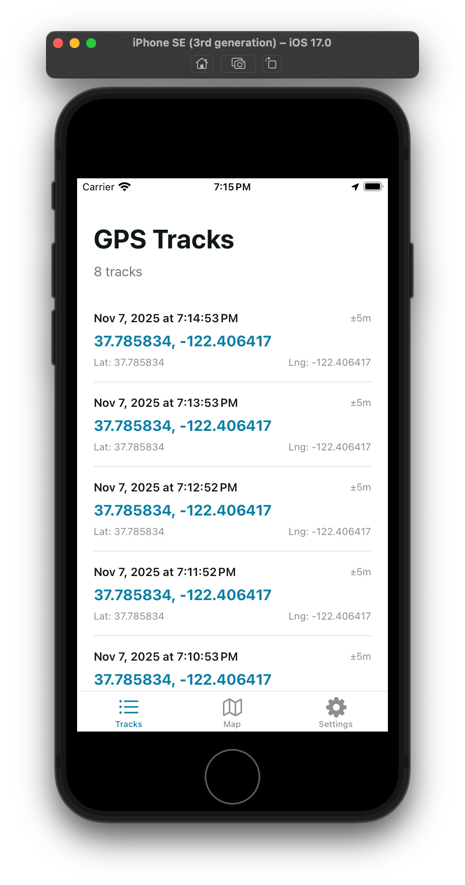
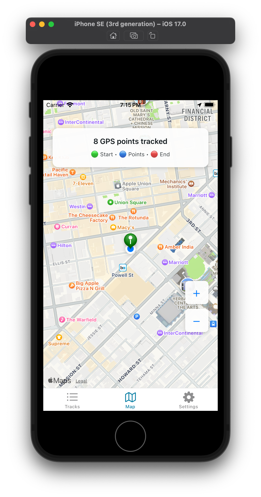
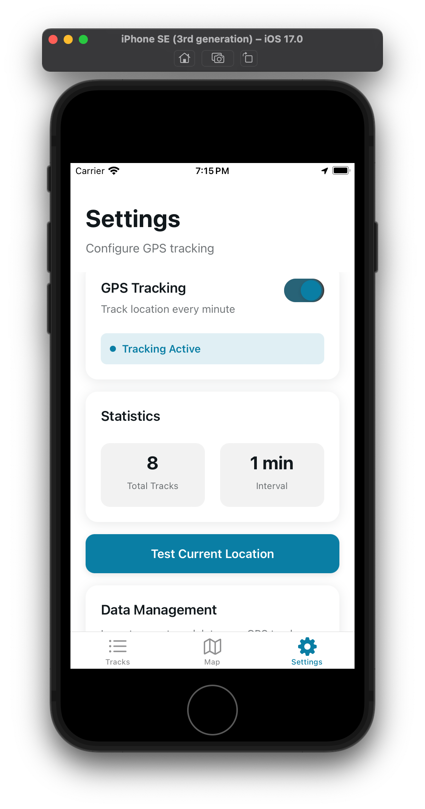

# GPS Tracker App

A React Native app built with Expo that tracks GPS coordinates (latitude, longitude) every minute and persists the data locally.


## Screenshots

<table align="center">
  <tr>
    <td align="center">
      <br/>
      Tracks List
    </td>
  </tr>
  <tr>
    <td align="center">
      <br/>
      Map Screen
    </td>
  </tr>
  <tr>
    <td align="center">
      <br/>
      Settings
    </td>
  </tr>
</table>


<<<<<<< Updated upstream

=======
>>>>>>> Stashed changes


## Features

- 📍 **GPS Tracking**: Automatically tracks your location every 60 seconds
- 💾 **Data Persistence**: All GPS tracks are stored locally using AsyncStorage
- 📊 **Tracks List**: View all collected GPS data with timestamps and accuracy
- ☁️ **iCloud Backup**: Export GPS tracks to iCloud Drive and import them back (iOS)
- ⚙️ **Settings**: Enable/disable tracking with a simple toggle
- 🌓 **Dark Mode**: Supports both light and dark themes
- 📱 **Background Tracking**: Continues tracking when app is minimized (with proper permissions)
- 🔄 **Auto-restore**: Automatically resumes tracking on app restart if it was previously enabled

## Project Structure

```
/Users/ize/Desktop/ai-gps-tracker/
├── app/
│   ├── (tabs)/
│   │   ├── index.tsx         # Tracks List screen
│   │   └── explore.tsx       # Settings screen
│   └── _layout.tsx           # Root layout with tracking restoration
├── services/
│   ├── storage.ts            # AsyncStorage service for data persistence
│   ├── locationTracker.ts    # GPS tracking service
│   └── icloudService.ts      # iCloud export/import service
└── app.json                  # Expo configuration with permissions
```

## Getting Started

1. **Install dependencies**

   ```bash
   npm install
   ```

2. **Start the app**

   ```bash
   npx expo start
   ```

3. **Run on a device**

   - Press `i` for iOS simulator
   - Press `a` for Android emulator
   - Scan the QR code with Expo Go app on your physical device

   > **Note**: GPS tracking works best on physical devices. Simulators/emulators may have limited location capabilities.

## Usage

### Tracks Tab
- View all collected GPS tracks
- Each track shows:
  - Timestamp
  - Latitude and Longitude
  - Location accuracy (in meters)
- **Export to iCloud**: Save your GPS tracks to iCloud Drive or any other location
- **Import from iCloud**: Load GPS tracks from a previously exported file
  - Choose to replace current tracks or merge with existing data
- Clear all tracks with the "Clear All Tracks" button

### Settings Tab
- Toggle GPS tracking on/off
- View statistics (total tracks, interval)
- Test current location
- Information about how the tracker works

## Permissions

The app requires the following permissions:

**iOS:**
- Location When In Use
- Location Always (for background tracking)
- iCloud Drive (for backup/restore functionality)

**Android:**
- ACCESS_FINE_LOCATION
- ACCESS_COARSE_LOCATION
- ACCESS_BACKGROUND_LOCATION

These permissions are configured in `app.json` and will be requested when you first enable tracking.

## Technical Details

- **Framework**: React Native with Expo
- **Navigation**: Expo Router with file-based routing
- **Location**: expo-location
- **Storage**: @react-native-async-storage/async-storage
- **File System**: expo-file-system (for export/import)
- **Sharing**: expo-sharing (for iCloud export)
- **Document Picker**: expo-document-picker (for file import)
- **Tracking Interval**: 60 seconds
- **Data Format**: JSON with id, latitude, longitude, timestamp, and accuracy
- **Export Format**: JSON with metadata (export date, app version, tracks count)

## How It Works

1. Enable tracking in the Settings tab
2. The app requests location permissions
3. GPS coordinates are captured every 60 seconds
4. Data is automatically saved to local storage
5. View all collected tracks in the Tracks tab
6. Tracking continues even when the app is minimized (with background permissions)
7. If you close and reopen the app, tracking automatically resumes if it was previously enabled

### Using iCloud Backup (iOS)

**Exporting Tracks:**
1. Go to the Tracks tab
2. Tap "📤 Export to iCloud"
3. Choose where to save the file (iCloud Drive, Files app, etc.)
4. Your tracks are saved as a JSON file with metadata

**Importing Tracks:**
1. Go to the Tracks tab
2. Tap "📥 Import"
3. Choose to either:
   - **Replace Current**: Delete existing tracks and import new ones
   - **Merge with Current**: Add imported tracks to existing data
4. Select your previously exported JSON file
5. Tracks are imported and displayed immediately

The exported file contains:
- Export date and time
- App version
- Total number of tracks
- All GPS track data (latitude, longitude, timestamp, accuracy)

## Development

This project uses:
- TypeScript for type safety
- Expo Router for navigation
- React hooks for state management
- Expo Location API for GPS tracking
- AsyncStorage for data persistence

## Learn More

- [Expo Documentation](https://docs.expo.dev/)
- [Expo Location](https://docs.expo.dev/versions/latest/sdk/location/)
- [React Navigation](https://reactnavigation.org/)
