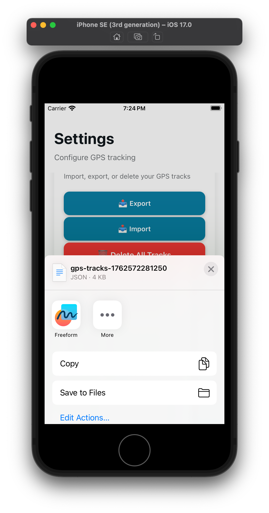

# GPS Tracker App

A React Native app built with Expo that tracks GPS coordinates (latitude, longitude) every minute and persists the data locally.

## Screenshots

<table align="center">
  <tr>
    <td align="center">
      <b>Tracks List</b> 
      
    </td>
    <td align="center">
      <b>Settings</b> 
      
    </td>
  </tr>
  <tr>
    <td align="center">
      <b>Map Screen</b> 
      
    </td>
    <td align="center">
      <b>Export Data Feature</b> 
      
    </td>
</table>

## Features

- 📍 **GPS Tracking**: Automatically tracks your location every 60 seconds
- 💾 **Data Persistence**: All GPS tracks are stored locally using AsyncStorage
- 📊 **Tracks List**: View all collected GPS data with timestamps and accuracy
- ☁️ **iCloud Backup**: Export GPS tracks to iCloud Drive and import them back (iOS)
- ⚙️ **Settings**: Enable/disable tracking with a simple toggle
- 🌓 **Dark Mode**: Supports both light and dark themes
- 📱 **Background Tracking**: Continues tracking when app is minimized (with proper permissions)
- 🔄 **Auto-restore**: Automatically resumes tracking on app restart if it was previously enabled

